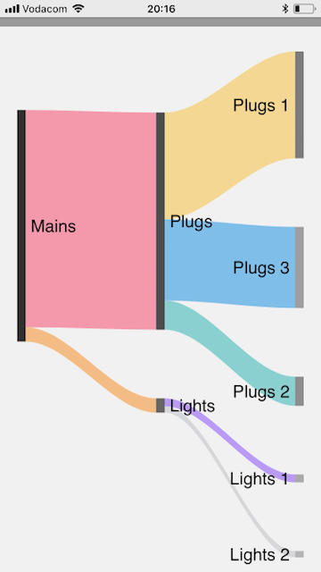
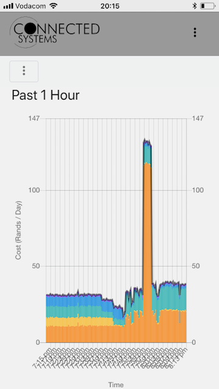
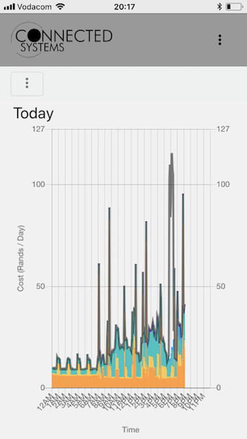
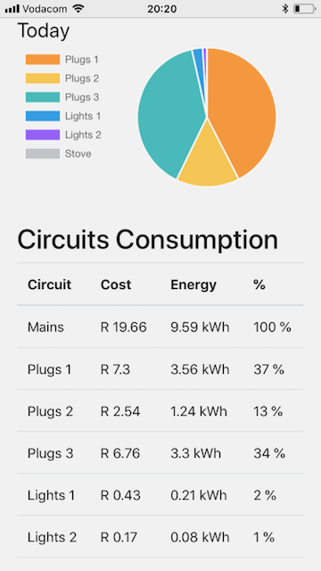
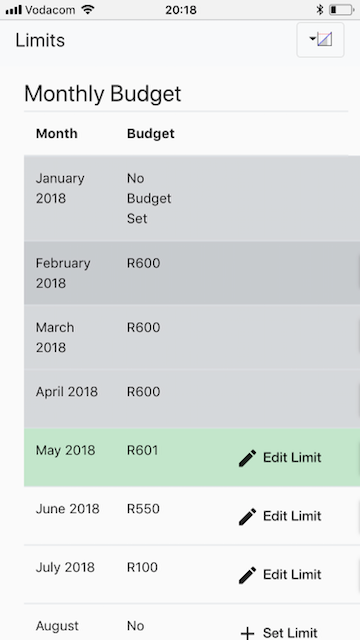
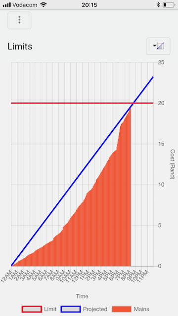

# Remote Electricity Monitoring - Client Web App
Worked this project with a friend in 2017. We were hoping to use it to start a business. Duration this process I developed the full software stack (detailed below and also in API repo). We also developed the hardware to record and send the data. It had some good architect decisions and a few bad ones too, some of these are detailed at the end. Overall it was a great learning experience. 
## Aim
Reduce users running costs by informing the user of what, how, when and how much they of are consuming electricity in residential and small commercial properties. 

## Functions
1. Allow the user to sign up and sign in
1. Allow the user to view the consumption 
    1. Current consumption
    1. Past Hour, Day, Month
    1. Selected time period
1. Allow the user to create daily or monthly limits. When the user exceed the limit he/she would be notified.

## Technology Stack
1. Angular 
    1. Admin App
        * Allowed admins to view client data to help make recommendation to reduce consumption
    1. Client App
        * Allowed client to view data and set limits

1. NodeJS
    1. API 
        * User Auth
        * Serving up user consumption data
    1. Scheduled Aggregation Engine 
        * Aggregated raw data (20 second interval) to larger time interval (5 minute, hour and daily)
        * Recalculated users daily limits to help them not exceed their monthly limits
        * Send notifications to users
1. Azure Cloud
    1. Storage Table 
        * Raw and aggregated data
    1. Function App 
        * Raw data ingress uploaded to Azure Table Storage
1. MongoDB

## Screenshots
The screenshot below illustrate the some uses the systems could preform. 
<figure>
  
  <figcaption>Fig.1 - Shows what each circuit is consuming as a proportion of the total consumption.</figcaption>
</figure>
<figure>
  
  <figcaption>Fig.2 - Shows the consumption of each circuit over the past hour</figcaption>
</figure>
<figure>
  
  <figcaption>Fig.3 - Shows the consumption of each circuit over the past day</figcaption>
</figure>
<figure>
  
  <figcaption>Fig.4 - Shows the total consumption and cost of each circuit over the past day</figcaption>
</figure>
<figure>
  
  <figcaption>Fig.5 - Shows the screen which allows a user edit the monthly electricity consumption limits. From the monthly limit a daily limit would be calculated to help the user not exceed their monthly limit. The daily limits a recalculated each day. </figcaption>
</figure>
<figure>
  
  <figcaption>Fig.6 - Shows the user's consumption on the day with a prediction of the total. This graphs this that user is likely to exceed their daily limit.</figcaption>
</figure>

## Lessons Learnt
1. Don't develope two frontends for Admin and Client. There was a lot of common code and should been separate modules in one repo.
1. Get to a production environment quickly and ensure the production environment does not cost a lot. I deployed the frontend(s) and API on Azure App Service which is costly to run (and unnecessary). Should deployed the frontend using something like Netlify or as Static Site from Azure Storage (now available)
1. Setup CI/CD early on in project
1. I wish I had known more about serverless as I would have developed the API, Aggregation Engine and Data Ingress Function as one repo.
